<!--
<div align="center">
  
</div>
-->

<p align="center">
  
</p>


---

# 

```yaml
operative: "CLASSIFIED"
alias: "howdoiusekeyboard"
base_of_operations: "Dubai, United Arab Emirates"
current_mission: "Founding Engineer Intern @ Aipply"
clearance_level: "Level 5 (Admin)"
archetype: "Technomancer / Vigilante Dev"
primary_directives:
  - "Bridge Physical & Digital Realms (Robotics & Digital Twins)"
  - "Secure the Network (Cybersecurity & Digital Forensics)"
  - "Optimize the Flow (Full-Stack & Workflow Automation)"
  - "Illuminate the Black Box (Explainable AI & Transparency)"
education: "B.E. Computer Science, BITS Pilani Dubai Campus (Senior, 4th Year)"
status: "Online & Ready to Deploy"
```

---

## 

| **Module** | **Component Technologies** |
| :--- | :--- |
| **The Mainframe**<br>*(Web Infrastructure)* |       |
| **The Cyber-Deck**<br>*(AI/ML Engine)* |        |
| **The Sentinel**<br>*(Robotics Stack)* |     |
| **The Fortress**<br>*(DevOps & Security)* |      |
| **The Archive**<br>*(Data Layer)* |      |


## 

```
CORE SYSTEMS & ARCHITECTURE:
├── CS F372   | OPERATING SYSTEMS
├── CS F303   | COMPUTER NETWORKS
├── CS F342   | COMPUTER ARCHITECTURE
├── CS F363   | COMPILER CONSTRUCTION
├── CS F211   | DATA STRUCTURES & ALGORITHMS
├── CS F212   | DATABASE SYSTEMS
└── CS F213   | OBJECT ORIENTED PROGRAMMING

INTELLIGENCE & APPLIED MATH:
├── CS F437   | GENERATIVE AI
├── CS F429   | NATURAL LANGUAGE PROCESSING
├── BITS F459 | COMPUTER VISION
├── CS F214   | LOGIC IN COMPUTER SCIENCE
├── CS F351   | THEORY OF COMPUTATION
├── MATH F113 | PROBABILITY & STATISTICS
└── MATH F211 | MATHEMATICS III

HARDWARE, SECURITY & SIGNALS:
├── BITS F463 | CRYPTOGRAPHY
├── CS F241   | MICROPROCESSORS & INTERFACING
├── CS F215   | DIGITAL DESIGN
└── EEE F111  | ELECTRICAL SCIENCES
```

**Advanced Specializations:** Robotics, XAI, Digital Twins, Cybersecurity, Graph Databases

---

## 

### 
**Status:** `ACTIVE | Weeks 1-8 (Jan-March 2025)`  
**Classification:** UNDERGRADUATE SPECIAL PROJECT

> **Threat Assessment:** *Autonomous agents operate as black boxes. In complex environments, inexplicable machines are liabilities. Trust is failing.*

**Tactical Solution:**  
Deployment of the **Intelligent Digital Twin** system. Fusing ROS2 Humble navigation stack with Gazebo simulation and Gemini LLM to create a robot with conscience. The system explains tactical decisions in natural language while maintaining conversational memory and detecting anomalies via parallel digital twin monitoring.

**Mission Parameters:**
- **Conversational Memory:** 5-10 turn dialogue with spatial context resolution ("go back there")
- **Explainable AI:** Real-time navigation explanations (<2s latency, >90% comprehension)
- **Digital Twin Anomaly Detection:** ML-based deviation monitoring with >80% accuracy
- **Tech Stack:** ROS2 | Gemini-API | React-TypeScript | Gazebo | Python | Whisper | SQLite | PyTorch

**Current Progress:** Week 1 Complete (12.5% timeline) - ROS2 workspace configured, 4 nodes implemented, dashboard UI extended  
**Supervisor:** Dr. Sujala D. Shetty (BITS Pilani Dubai)  
**Deliverables:** Technical Report | Demo Video | Conference Paper Submission (ICRA/IROS)

---

###  [🔗](https://github.com/howdoiusekeyboard/graphlit-expansion)
**Status:** `PRODUCTION`  
**Classification:** GRAPH DATABASE MANAGEMENT SYSTEM

> **Threat Assessment:** *Data fragmentation in academic research is critical. Vital connections between papers are lost in linear databases. Knowledge flow is stalled.*

**Tactical Solution:**  
Initialization of **GraphLit** - a Neo4j-powered system treating literature as networks, not lists. Enables constant-time traversal of citation chains and real-time discovery of knowledge evolution patterns.

**Performance Metrics:**
- **Citation Query:** 6ms (vs 50ms SQL)
- **Multi-Hop Chain (3-levels):** 24ms (vs 500ms+ SQL Recursive CTE)
- **Network Visualization:** 22ms (N/A in SQL)
- **Code Conciseness:** 5-7x reduction vs RDBMS

**Tech Stack:** Neo4j 5.26.12 | Cypher | Graph Data Science Library 2.22.0 | OpenJDK 17  
**Publication:** IEEE Xplore & Taylor & Francis Chapter Author

---

### 
**Status:** `COMPLETED | AWARDED`  
**Classification:** HACKATHON CHAMPION

> **Threat Assessment:** *Environmental degradation accelerating. Passive awareness campaigns ineffective against modern consumption entropy.*

**Tactical Solution:**  
Launch of **EcoQuest** - Gamified sustainability platform weaponizing psychology for good. Won **BEST PROJECT AWARD** at BITS Tech Fest Community Day Event.

**Impact:** Engaged 200+ users in real-world eco-activities through competitive digital platform  
**Tech Stack:** React-Native | Gamification Engine | Sustainability Analytics

---

### 
**Status:** `PRODUCTION`  
**Classification:** FULL-STACK AUTOMATION ECOSYSTEM

**Mission Scope:** End-to-end job search automation across 8+ Indian portals with AI-powered form filling, credential encryption, and subscription management.
  <a href="https://linkedin.com/in/kushagra-golash">
    
  </a>
  <a href="mailto:f20220226@dubai.bits-pilani.ac.in">
    
  </a>
  <a href="https://github.com/howdoiusekeyboard">
    
  </a>
  <a href="https://www.kushagragolash.tech">
    
  </a>
</div>

**Backend (aipply-script):**  
- **Stack:** Node.js 20+ | Express | MongoDB | Redis | Bull Queue | Puppeteer | Vertex AI  
- **Integrations:** Naukri, Foundit, Hirist, Shine, TimesJobs, Internshala, CutShort, IIMJobs  
- **AI Engine:** Gemini-2.5-pro for intelligent form filling | Tesseract OCR for CAPTCHA solving  
- **Infra:** Docker | Google Cloud Run | Session Pooling | Stealth Automation

**Admin Dashboard:**  
- **Stack:** Next.js 15 | Firebase Admin | Radix UI | Recharts  
- **Features:** Role-Based Access (admin claims) | User CRUD | Analytics | Credential Management

**Impact Metrics:**  
- **Processing Speed:** 3-second AI matching | 5.7x CV processing speedup  
- **Security:** AES-256 encryption for platform credentials  
- **Deployments:** 4 production systems | 2 hackathon projects

---

### 
**Status:** `RESEARCH COMPLETE`  
**Classification:** COMPUTER VISION RESEARCH

**Breakthrough:** 5.7x speedup on 2048x2048 satellite imagery using Vision Transformers with adaptive resolution feature extraction.

**Technical Achievements:**
- **Baseline (Sliding Window):** 9408ms per image (81 ViT passes)
- **Adaptive (Attention-Guided):** 1796ms per image (5.7x faster)
- **Feature Similarity:** 88.4% maintained accuracy
- **Model:** ViT-Large with SatMAE pretrained weights (FMoW dataset)
- **Crossover Point:** 1024x1024 resolution (beneficial for large images only)

**Tech Stack:** PyTorch | Vision Transformers | CUDA | timm | UC Merced Land Use Dataset

---

### 
**Status:** `COMPLETED | AWARDED`  
**Classification:** HEALTHCARE AI

**Mission:** AI-powered prescription reminder chatbot for elderly care using Botpress and Telegram API. Demonstrably improved medication adherence through empathetic, timely interactions.

**Recognition:** 1st Place Winner - HACK-A-BOT Hackathon 2025

---

### 
**Status:** `HACKATHON COMPLETE`  
**Classification:** EMERGENCY RESPONSE SYSTEM

**Mission:** GIS-based emergency dispatch optimization for Microsoft Tech Club & GDG hackathon. Uses n8n workflows, LangFlow agents, and Ollama LLMs to calculate optimal routes for Fire/Ambulance/Police services.

**Tech Stack:** Python GIS | n8n | LangFlow | Ollama | Google Maps Distance Matrix API  
**Performance:** Real-time route calculation with multi-service dispatch

---

### 
**Status:** `PRODUCTION` | **Live:** `https://talkhuman-mcp.vercel.app`  
**Classification:** MCP PROTOCOL SERVER

**Mission:** Model Context Protocol server detecting and eliminating AI-generated text patterns ("slop"). Provides research-backed tools for human-like writing.

**MCP Tools:**  
- `get_human_writing_rules` - Comprehensive writing guidelines  
- `check_for_slop` - Pattern detection (26 AI phrases, verbosity, hedging)  
- `get_slop_examples` - Before/after transformations

**Tech Stack:** TypeScript | MCP SDK | Zod | Vercel Serverless  
**Transport:** Dual STDIO + HTTP support

---


### 
**Status:** `PRODUCTION DEPLOYED`  
**Classification:** NLP PIPELINE

**Mission:** Robust multilingual address parsing for New Delhi using **IndicBERTv2-CRF**. Led end-to-end ML lifecycle: curated 5K+ dataset, trained models, and deployed **ONNX-optimized** inference on Google Cloud Run.

**Impact:** High-throughput processing (10,000+ addresses/min) achieving 94% F1 score, critically improving downstream electrical distribution systems.

---


## 

<div align="center">
  
</div>

<div align="center">
  
</div>

---

## 

```yaml
# Auto-updated via GitHub Actions workflow
# Last Scan: November 2025

transmissions:
  - type: "PUBLICATION"
    title: "Enhancing Financial Market Analysis: Bitcoin vs Gold through ML"
    outlet: "IEEE Xplore"
    date: "August 2024"
    
  - type: "PUBLICATION"
    title: "Cybersecurity in Critical Infrastructure: Electrical Distribution"
    outlet: "Taylor & Francis Group"
    date: "July 2024"
    
  - type: "HACKATHON"
    event: "HACK-A-BOT 2025"
    achievement: "1st Place Winner"
    project: "Pill-Pal AI Prescription Reminder"
    
  - type: "LEADERSHIP"
    role: "Technical Lead"
    organization: "Linux User's Group, BITS Dubai"
    tenure: "August 2023 - May 2025"
    impact: "Mentored 50+ members | Led 10+ technical workshops"
```

---

## 

<div align="center">
  <a href="https://linkedin.com/in/kushagra-golash">
    
  </a>
  <a href="mailto:f20220226@dubai.bits-pilani.ac.in">
    
  </a>
  <a href="https://github.com/howdoiusekeyboard">
    
  </a>
  <a href="https://www.kushagragolash.tech">
    
  </a>
</div>

---

> **"It's not who I am underneath, but what I do that defines me."**  
> —The Dark Knight