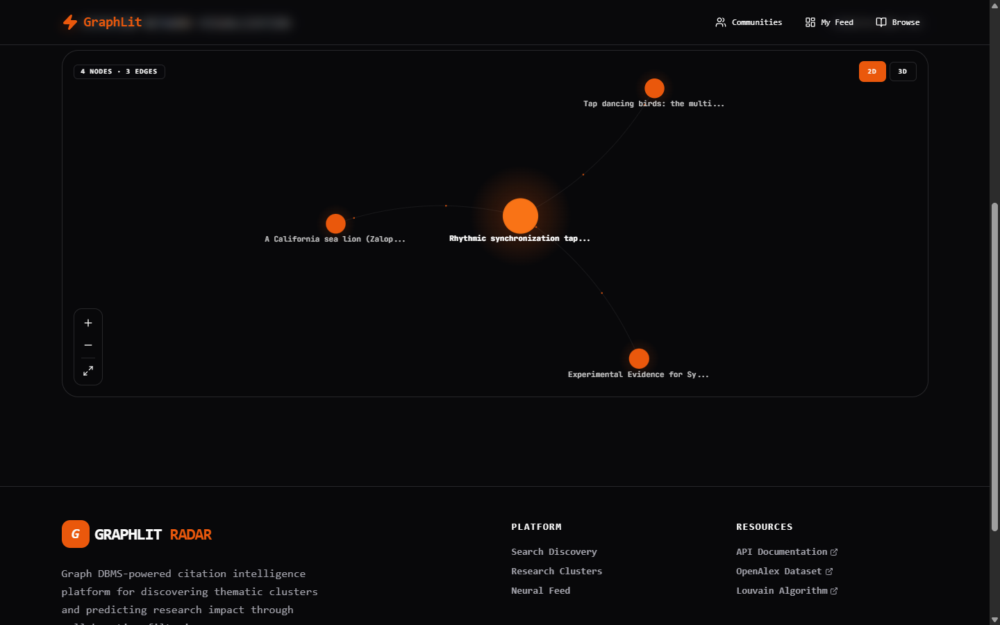

<!--
  GitHub profile · Kushagra Golash
  Source of truth: profile/data.yaml
  Build:           profile/build.ts
  Pipeline:        .github/workflows/build-profile.yml (nightly @ 03:00 UTC)
  Generated:       2026-05-11T15:54:54.227Z
-->

# Kushagra Golash

↳ <code>howdoiusekeyboard</code> · the operative who can't find the any key

 

---

## ▶ CURRENT OPERATION

> Shipping cross-platform haptics for the mobile web · researching graph traversal for academic citation networks · maintaining MCP servers that enforce writing quality.

> Want to know what I'm shipping next?
>
> - [ ] `Ducati` → WebRTC realtime audio pipeline (hands-free voice-advisor mode)
> - [ ] `graphlit-expansion` → real-time inference layer + GraphQL endpoint
> - [ ] `TrueVoice-MCP` v2 → expanded slop taxonomy + tone fingerprinting
> - [ ] `indian-address-parser` → Hindi-only fine-tune + Devanagari edge cases
> - [ ] `@haptics/core` v2 → Web Audio API fallback for older iOS

---

## PROJECTS

### · AI / MCP

<table>
<tr>
<td width="50%" valign="top">

**MCP server that detects AI slop and enforces human-style writing rules.**

Dual transport (stdio + HTTP), one-click install across Claude Desktop, Cursor, VS Code, Claude Code. Scoring across utility, style, and structure dimensions.

`TypeScript` · `MCP SDK` · `Zod` · `Vercel`

</td>
<td width="50%" valign="top">

**AI purchase advisor grounded in your real financial profile.**

Gemini Flash Lite vision scoring on Next.js 16 with Firebase 12 persistence. Hands-free voice-advisor mode in flight — WebRTC pipeline for real-time audio with OpenAI Realtime currently being wired.

`Next.js 16` · `Gemini Flash Lite` · `Firebase 12` · `OpenAI Realtime` · `WebRTC` · `TypeScript`

</td>
</tr>
</table>

### · Graph / Backend

<table>
<tr>
<td width="55%" valign="middle">

</td>
<td width="45%" valign="top">

**Academic citation graph expansion + hybrid recommender over OpenAlex and Neo4j.**

Idempotent BFS through 1,000-paper expansions in 20-40 min · Louvain communities + PageRank + 4-component hybrid recommender (citation overlap × topic affinity × author collaboration × velocity, 30/25/25/20 weighted) · 50 parallel fetches, 80 req/s · 895 papers indexed across 8 communities · time-decayed personalised feeds with cold-start fallback.

`Python 3.14` · `Neo4j 6.1` · `FastAPI` · `Pydantic` · `Louvain` · `PageRank`

[**↗ Live Demo**](https://graphlit.kushagragolash.tech)

</td>
</tr>
</table>

### · Hardware / Web

  

**Cross-platform haptic feedback library that finally makes iOS Safari vibrate.**

Unifies mobile-web vibration across iOS (the checkbox-switch workaround for Safari 17.4+) and Android navigator.vibrate() · framework-agnostic core plus typed bindings for React, Vue 3, Svelte 5 · 7 built-in presets (selection, impact, success, warning, error) · respects prefers-reduced-motion · capture-phase listeners preserve native gestures · desktop silent no-op.

`TypeScript` · `React` · `Vue 3` · `Svelte 5` · `iOS Safari 17.4+`

[**npm: @haptics/core v1.0.0**](https://www.npmjs.com/package/@haptics/core)

### · ML / NLP

  

**Fine-tuned IndicBERTv2-SS + CRF that decomposes messy Indian addresses into 15 structured entities.**

94.3% F1 on test set (most entities >95%) · ~25 ms avg inference, <30 ms p99 · Hindi (Devanagari) + English support · gazetteer-refined transliteration · packaged as a pip-installable library with FastAPI service and Gradio demo on Google Cloud Run.

`PyTorch` · `IndicBERTv2-SS` · `CRF layer` · `FastAPI` · `Cloud Run`

[**↗ Live Demo**](https://addressparser.kushagragolash.tech)

---

## LOADOUT

<table>
<tr>
<td valign="top" width="25%">

**Languages**

</td>
<td valign="top" width="25%">

**AI & ML**

</td>
<td valign="top" width="25%">

**Web & APIs**

</td>
<td valign="top" width="25%">

**Infra & Data**

</td>
</tr>
</table>

---

## TELEMETRY 

---

Ship things that don't exist yet. Then ship the source.

  built from <code>profile/build.ts</code> ·
  pinged demos ·
  regenerated nightly · last build <code>2026-05-11T15:54:54.227Z</code>

